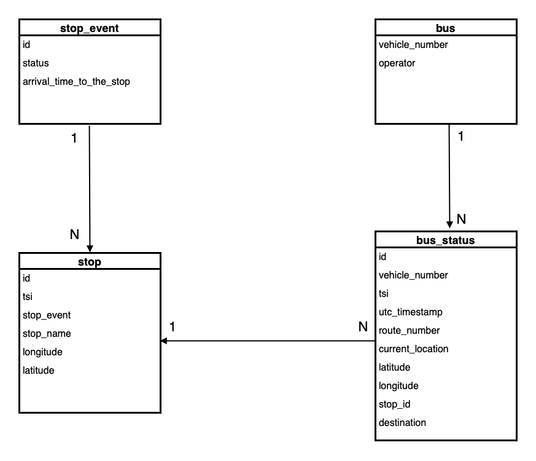

# Helsinki Bus Tracker

Welcome to the Helsinki Bus Tracker, the upgraded version (2.0) of Finland Bus Routes! This application consumes telemetry from the MQTT broker server mqtt.hsl.fi, stores the telemetry data, and makes it searchable through an API. The API, accessible via HTTP, provides information about the location and next stops for the buses in the greater Helsinki area. All this information can be accessed through this application.  


## Version 2 Updates

Discover the enhanced features and improvements in Finland Bus Routes Version 2.0:

- **Faster:** Up to 5x more threads are now working simultaneously to fetch the most recent data.
  
- **Reliable:** Improved error handling and resolution of many bugs for a more dependable experience.

- **Optimized Code:** Version 2 incorporates optimizations in the codebase, enhancing overall performance and efficiency. The streamlined and optimized code ensures faster execution, reduced resource utilization, and a more responsive system, contributing to a smoother user experience.
  
- **Constructive and Cleaner API Objects:** Version 2 introduces a more structured and well-organized API, making it easier to understand. The enhanced structure includes additional information, contributing to the development of a more robust and helpful backend for developers.

- **Timing of Cleanup:** Thanks to the latest robust error handling mechanisms, the cleanup application for the database is now scheduled every 6 minutes as a standard option. This enhancement not only ensures a more streamlined data maintenance process but also provides you with a richer dataset to explore during the testing phase before it becomes your real-life bus tracking app. 

If u wish to check out the old version of this application, Finland Bus Routes V1, please follow the link to its github repository below:
https://github.com/ahmetugsuz/Finland_Bus_Routes  


## Table Of Contents
- [Features](#features)
- [Overview](#overview)
- [Getting Started](#getting-started)
    - [Method 1 (Recommended)](#method-1)
    - [Method 2](#method-2)
- [Usage](#usage)
- [More Information](#more-information)
    - [Key Features](#key-features)
    - [Use Cases](#use-cases)
    - [Architecture](#architecture)
        - [Database Architecture](#database-architecture)
        - [Database Relation Diagram](#database-relation-diagram)
    - [Cleanup Program](#cleanup-application)
        - [Configuration](#configuration)
    - [MQTT telemetry data subscription](#mqtt-telemetry-data-subscription)
    - [Error Handling and Data Resilience](#error-handling)
- [Contributing](#contributing)
- [License](#license)


## Features <a name="features"></a>
This project includes the following features:
- Consume telemetry from mqtt.hsl.fi
- Store the telemetry
- Make the telemetry searchable in a sane way through an API (http/gRPC/SignalR)
- Host the infrastructure needed to run the service in docker


## Overview <a name="overview"></a>

**Helsinki Bus Tracker** is a comprehensive service designed to capture real-time telemetry data from the MQTT server, mqtt.hsl.fi. This service not only gathers telemetry data but also stores it for future use, making it easily accessible via a user-friendly API. Its primary focus is to provide up-to-date information about bus locations, upcoming stops, and more, specifically for the bus network in the region of Helsinki. It also includes a cleanup program that manages database memory. This feature can be particularly useful when the intended use of this program is for a short or long duration, allowing you to set up a time management schedule for cleaning up the database.    

**Purpose:** This project was created to help commuters, travelers, and developers access up-to-date information about bus routes and schedules in the greater Helsinki. My goal is to provide an easy-to-use and reliable source of data for a better public transportation experience. If desired, I also aim to develop a frontend for this backend service, creating a full-stack application that can be widely utilized.  

**Key Benefits:** With Helsinki Transit Tracker, users can quickly find information about buses near their location, search for buses based on specific locations in greater Helsinki, using their city and street names within a specified radius, check the every record stored of a bus by their vehicle number, retrieve current location, route number, destination, operator, status, arrival time to the next stop, and more for every bus that is currently in active status in Helsinki.  

**Audience:** This project is designed for public transportation enthusiasts, developers, and anyone looking to streamline their bus travel experience in Helsinki region.  

**License:** This project is open-source and available under the [CC BY-NC](LICENSE), with restriction on commercial use.  

**Contributing:** If you'd like to get involved, please refer to my website and contact me: [ahmettu.com](https://www.ahmettu.com) 

**Status:** Helsinki Bus Tracker is actively maintained and continuously updated to provide the latest and most accurate bus telemetry data.  


## Getting Started <a name="getting-started"></a>

To run the application, you can use Docker Compose, which simplifies the setup process (as shown in Method 1). To do that, you will need to have [Docker Desktop](https://docs.docker.com/desktop/) installed and set up.

### Method 1: Using Docker Compose (Recommended, Easiest Way) <a name="method-1"></a>

#### Requirements:

Docker Compose:  
- Installation: Download and install Docker Desktop for your operating system from [Docker Desktop Installation](https://docs.docker.com/desktop/).

#### Building the Application <a name="building"></a>

1. Clone the GitHub repository to your local machine:  

       git clone https://github.com/ahmetugsuz/Helsinki_Bus_Tracker

2. Change (if you're not in this directory already) to the project's directory:   

       cd Helsinki_Bus_Tracker  

3. Make sure the `docker-compose.yml` file is present in the project's root directory, and
    that you have Docker Desktop installed on your machine.

#### Running the Application

4. Running the application:  

       docker-compose build

5. Run the following command to start the application using Docker Compose:  

       docker-compose up  

6. Access the API at http://localhost:5001/{API-endpoint} and interact with it as described in the [Usage](#usage) section.  

7. To stop the application, press:
    - `Ctrl+C` in the terminal  
    or   
    - run the following command: `docker-compose down` in a separate terminal window.

Running `docker-compose down` will not only stop the application but also remove the associated Docker images. If you wish to restart the application, you'll need to rebuild it with the following instructions in part 4.  

Additionally, you can also use the Ctrl+C keyboard shortcut to stop the running Docker containers, and if you wish to remove the associated Docker images, you can type `docker-compose down`.  

To delete stored data from the database, first do a `docker-compose down` and then `docker-compose down -v`. Be careful, as this will remove all data who has been stored until now from your database.  

These steps allow you to easily start, stop and delete the entire application, including all the required services, using Docker Compose.


### Method 2: Running Docker commands manually <a name="method-2"></a>

#### Requirements

Docker:  
- **Installation:** Download and install Docker (Engine) for your operating system from [Docker Engine Installation](https://docs.docker.com/engine/install/). Docker Engine is core component of Docker that allows to build, run, manage container. To be able to pull container images from Docker Hub, you need to have the Docker Engine installed.   
***Note:*** Docker Desktop is a comprehensive package that includes the Docker Engine. If you've already installed Docker Desktop, you have the Docker Engine installed and ready to use.

1. **Pull the database image** from Docker Hub by typing the following command in your terminal to download the image:    

       docker pull ahmettugsuz/all_bus_routes_finland:db-v2.0    

2. Pull the application image:  

       docker pull ahmettugsuz/all_bus_routes_finland:app-v2.0   
       
3. Pull the cleanup image:  

       docker pull ahmettugsuz/all_bus_routes_finland:cleanup-v1.0   

    **helping hints #1:** just cpy/pull all of them at once; run this cmd in the terminal:   

        docker pull ahmettugsuz/all_bus_routes_finland:db-v2.0
        docker pull ahmettugsuz/all_bus_routes_finland:app-v2.0
        docker pull ahmettugsuz/all_bus_routes_finland:cleanup-v1.0  
         

4. Run the database container:  

       docker run -d --name bus_routes_db -p 5432:5432 -e POSTGRES_USER=ahmettugsuz -e POSTGRES_PASSWORD=bus_finland -e POSTGRES_DB=bus_data ahmettugsuz/all_bus_routes_finland:db-v2.0           

5. Run the application container:

       docker run -d --name bus_routes_app -p 5001:5001 --link bus_routes_db:host-bus_routes_db ahmettugsuz/all_bus_routes_finland:app-v2.0   

6. Run the cleanup container:

       docker run -d --name bus_routes_cleanup -p 5001:5001 --link bus_routes_db:host-bus_routes_db ahmettugsuz/all_bus_routes_finland:cleanup-v1.0   

    **helping hints #2:** just run all of them at once with correct order:    

        docker run -d --name bus_routes_db -p 5432:5432 -e POSTGRES_USER=ahmettugsuz -e POSTGRES_PASSWORD=bus_finland -e POSTGRES_DB=bus_data ahmettugsuz/all_bus_routes_finland:db-v2.0      
        docker run -d --name bus_routes_app -p 5001:5001 --link bus_routes_db:host-bus_routes_db ahmettugsuz/all_bus_routes_finland:app-v1.0  
        docker run -d --name bus_routes_cleanup -p 5001:5001 --link bus_routes_db:host-bus_routes_db ahmettugsuz/all_bus_routes_finland:cleanup-v1.0    
        

7. Access the API at http://localhost:5001 and interact with it as described in the [Usage](#usage) section.  

8. To stop the application, run the following commands:   

       docker stop bus_routes_app  
       docker stop bus_routes_cleanup  
       docker stop bus_routes_db    

9. To remove the images:  

       docker rm bus_routes_app     
       docker rm bus_routes_cleanup  
       docker rm bus_routes_db       


## Usage <a name="usage"></a>

Once the containers are up and running, you can access the API endpoints by navigating to http://localhost:5001 and appending the desired endpoint to the URL. Alternatively, click on the endpoints listed below.   
**Note:** By default, the API limits the response to the latest 300 updates for each endpoint to ensure efficient data retrieval. However, you can adjust this limitation if needed. Additionally, the data is periodically cleaned up by a cleanup application, and you can configure the cleanup interval based on your usage preferences, from [cleanup configuration](#configuration). For development testing or real-life use, the cleanup interval and data limitation can be customized according to your requirements.   
The following endpoints are available:   

***Hint!*** When the application is running, come back here and make use of the API-endpoint links below by clicking on them, as long as they are not marked with `{}`. If they are, it means a paramter that you need to set a value for, either a place name or a number. 

- **[GET] http://localhost:5001/locations**  <a name="locations"></a>
This endpoint returns JSON data of locations for active buses in the Helsinki region.   
    **Example response for API endpoint `/locations`:**   
 
    ```json
    {
        "telemetry": {
            "vehicle": {
                "number": 1384,
                "operator": "Nobina Finland Oy",
                "current_location": "11 B, Tilanhoitajankaari, Latokartano, Uusimaa",
                "latitude": 60.229991,
                "longitude": 25.029556
            },
            "timestamp": {
                "tsi": 1701467994,
                "utc_formatted": "21:59:54"
            },
            "route": {
                "number": "79",
                "destination": "Herttoniemi (M)"
            }
        }
    }
    ```  

- **[GET] http://localhost:5001/locations/latest**  
This endpoint accumulates and provides the most recently available recorded data for each active bus in the Helsinki region. It offers data collected up to the last telemetry signal received for each bus, which may vary based on their individual transmission frequencies. This endpoint is an improvement of the base API-endpoint `/locations`, showing the same data, in same JSON format but with the most recent updates for each vehicle.    
    **JSON format:** The JSON objects will be structured the same as the example objects format provided for the example response for [`/locations`](#locations) API-endpoint as shown above.  

- **[GET] http://localhost:5001/locations/next_stop**  <a name="next_stop"></a>
This endpoint returns JSON data of locations and their next stop information for active buses in Helsinki, displaying the most recent updates for each bus.   
    **Example response for API endpoint `/next_stop`:**

    ```json
    {
        "telemetry": {
            "vehicle": {
                "number": 1238,
                "operator": "Nobina Finland Oy",
                "current_location": "Paciuksenkatu, Meilahti, Läntinen suurpiiri, Uusimaa",
                "latitude": 60.195445,
                "longitude": 24.890244,
                "status": "Ready to depart from a stop"
            },
            "timestamp": {
                "tsi": 1701529422,
                "utc_formatted": "15:03:42"
            },
            "route": {
                "number": "25",
                "destination": "Pajamäki"
            },
            "next_stop": {
                "name": "Paciuksenkaari",
                "address": "McDonald's - pääkonttori, 29, Paciuksenkatu",
                "lat_long": "60.195371, 24.890274",
                "arrival_time_to_the_stop": "15:04:00"
            }
        }
    }
    ```

- **[GET] http://localhost:5001/locations/ordered_by_vehicle**  
This API endpoint displays data in ascending order based on vehicle numbers. Easily view the latest updates for each vehicle number in a structured manner. Scroll down to access vehicles with higher numbers, facilitating quick lookup for specific vehicles and their latest updates. 
    **JSON format:** The JSON objects will be structured the same as the example objects format provided for the example response for [`/next_stop`](#next_stop) API-endpoint as shown above. 

- **[GET] http://localhost:5001/locations/next_stop/logger** 

- **[GET] http://localhost:5001/vehicles/{vehicle_number}**   
    This endpoint allows users to retrieve specific information for a vehicle by providing its unique vehicle number as a parameter in the URL.  

    **Parameters:**   
    - `vehicle_number` (integer): The unique identifier for the vehicle. Replace {vehicle_number} in the URL with the actual vehicle number.  

    **Example:**  
    To retrieve information for a vehicle with the number 1375, make a GET request to:  
    - http://localhost:5001/vehicles/1375  

    **Example response for vehicle number 1375:**   
    ```json
    [
        {
            "telemetry": {
                "vehicle": {
                    "number": 1375,
                    "operator": "Nobina Finland Oy",
                    "current_location": "Suutarilantie, Siltamäki, Suutarila, Uusimaa",
                    "latitude": 60.279989,
                    "longitude": 25.010392,
                    "status": null
                },
                "timestamp": {
                    "tsi": 1701872290,
                    "utc_formatted": "14:18:10"
                },
                "route": {
                    "number": "562",
                    "destination": "Itäkeskus (M)"
                },
                "next_stop": {
                    "name": "Hannukselanpolku",
                    "address": "Suutarilantie, Siltamäki, Suutarila",
                    "lat_long": "60.27948, 25.00944",
                    "arrival_time_to_the_stop": "None"
                }
            }
        },
        {
            "telemetry": {
                "vehicle": {
                    "number": 1375,
                    "operator": "Nobina Finland Oy",
                    "current_location": "Suutarilantie, Siltamäki, Suutarila, Uusimaa",
                    "latitude": 60.27971,
                    "longitude": 25.009967,
                    "status": "Arrives inside of a stop radius"
                },
                "timestamp": {
                    "tsi": 1701872294,
                    "utc_formatted": "14:18:14"
                },
                "route": {
                    "number": "562",
                    "destination": "Itäkeskus (M)"
                },
                "next_stop": {
                    "name": "Hannukselanpolku",
                    "address": "Suutarilantie, Siltamäki, Suutarila",
                    "lat_long": "60.27948, 25.00944",
                    "arrival_time_to_the_stop": "14:17:00"
                }
            }
        }
    ]
    ```  


- **[GET] http://localhost:5001/buses_within_radius/{street}/{city}/{radius}**  
    This endpoint allows users to search for buses within a specified radius based on various attributes such as street, city, region, or building number. Users can provide any combination of two of these attributes. The outcome depends on the specified radius; a larger radius captures signals from buses within a broader area around the address given in the url.

    **Parameters:**  

    - `building number` (int): The number of the building (optional).  
    - `street` (string): The name of the street or specific location (optional).  
    - `city` (string): The city in Finland (optional), especially cities in the Helsinki region.   
    - `region` (string): The region within Finland (optional), especially those close to or neighboring the Helsinki region.  
    - `radius` (integer): The search radius in meters.  

    **Example:**    
    To find buses within a 1000-meter radius of ***Mannerheimintie*** in ***Helsinki***, make a GET request to:  
    - http://localhost:5001/buses_within_radius/Mannerheimintie/Helsinki/1000  

    **Example Requests:** 

    i. Search by street and city, within a radius of 1000 meters:   

    * API-endpoint: `/buses_within_radius/Mannerheimintie/Helsinki/1000`   
    * Request Example: http://localhost:5001/buses_within_radius/Mannerheimintie/Helsinki/1000         

    ii. Search ny city and region, within a radius of 4000 meters:

    * API-endpoint: `buses_within_radius/Helsinki/Uusimaa/4000`   
    * Request Example: http://localhost:5001/buses_within_radius/Helsinki/Uusimaa/4000  

    ii. Search by street and region, within a radius of 2000 meters: 

    * API-endpoint: `/buses_within_radius/Mannerheimintie/Uusimaa/2000`   
    * Request Example: http://localhost:5001/buses_within_radius/Mannerheimintie/Uusimaa/2000   

    iii. Search by street and building number, within a radius of 1500 meters:   

    * API-endpoint: `/buses_within_radius/22/Tullivuorentie/1500`    
    * Request Example: http://localhost:5001/buses_within_radius/22/Tullivuorentie/1500            

    And more of these type of combinations ...  


    **Example Response on http://localhost:5001/buses_within_radius/Mannerheimintie/Uusimaa/1000:**   
    ```json
    [
        {
            "telemetry": {
                "vehicle": {
                    "number": 1239,
                    "operator": "Nobina Finland Oy",
                    "current_location": "Töölön kirkko, 4, Topeliuksenkatu, Uusimaa",
                    "latitude": 60.180019,
                    "longitude": 24.921968
                },
                "timestamp": {
                    "tsi": 1701551732,
                    "utc_formatted": "21:15:32"
                },
                "route": {
                    "number": "30",
                    "destination": "Myyrmäki"
                },
                "next_stop": {
                    "name": "Töölöntori",
                    "address": "3a, Topeliuksenkatu, Taka-Töölö",
                    "lat_long": "60.179773, 24.922318"
                }
            }
        },
        {
            "telemetry": {
                "vehicle": {
                    "number": 1919,
                    "operator": "Helsingin Bussiliikenne Oy",
                    "current_location": "9, Topeliuksenkatu, Töölö, Uusimaa",
                    "latitude": 60.18201,
                    "longitude": 24.919936
                },
                "timestamp": {
                    "tsi": 1701551733,
                    "utc_formatted": "21:15:33"
                },
                "route": {
                    "number": "63",
                    "destination": "Paloheinä"
                },
                "next_stop": {
                    "name": "Linnankoskenkatu",
                    "address": "25, Topeliuksenkatu, Eläintarha",
                    "lat_long": "60.18484, 24.917"
                }
            }
        }
    ]
    ```  

    ***Note:*** Replace the `street`, `city`, and `radius` values in the URL with your desired location and radius parameters.  
    ***Remember:***  A higher radius targets a larger area around the address provided in the URL. It is worth noticing that there might be "no bus found" within a radius of 500 meters (is it is only collecting buses with active status within given area/radius). This could be due to the cleanup application removing stored data to free up memory, or there might be no active buses in that area at that moment. Hence, consider increasing the radius or refreshing with the same parameters after a minute or so.

- **[POST] /buses_near_me**  

    This endpoint is designed for frontend use and allows users to request bus information near a specified location.
    It operates as a POST method to enable the frontend to send location data to the backend and receive bus data in response.

    **Input Parameters:**   
  
    - `location:` A JSON object containing information about the user's location, including street and city names (e.g., "street": "Turunväylä",  "city": "Vehkamäki"). 
    - `radius:` The radius (in meters) within which to search for buses near the provided location.  

    **Example Request (request body):**
    ```json
    POST /buses_near_me
    {
        "location": {
            "street": "Turunväylä",
            "city": "Vehkamäki"
        },
        "radius": 150
    }
    ```  

    **Example response from the backend to the frontend on request:**  
    ```json
    [
        {
            "vehicle_number": 1053,
            "route_number": "520",
            "utc_timestamp": "22:06:50",
            "current_location": "Turunväylä, Vehkamäki, Uusimaa",
            "destination": "Matinkylä (M)",
            "operator": "Oy Pohjolan Liikenne Ab",
            "next_stop": "Nihtisilta"
        }
    ]
    ```

    This is an alpha version and it is not yet in use from the developer side. If desired to be a real-life application, it can be updated to much more useful version with more relevant data.

## More Information <a name="more-information"></a>

### Key Features <a name="key-features"></a>

1. **Real-Time Telemetry Data**: The service continuously collects real-time telemetry data from the mqtt.hsl.fi MQTT server. Telemetry data typically includes GPS coordinates, speed, and other relevant information about buses operating in the Helsinki region.

2. **Data Storage**: All collected telemetry data is efficiently stored in a MySQL database for easy retrieval and analysis. Historical data can be invaluable for various purposes, such as route optimization and performance analysis.

3. **User-Friendly API**: To facilitate access to the collected data, the service offers a user-friendly JSON API. This API allows developers, transit enthusiasts, and researchers to access the telemetry data without the need for direct server access or complex data processing.

4. **Bus Location Information**: Users can retrieve precise information about the current location address of buses, including latitude and longitude (stored in the database). This feature is particularly useful for tracking the real-time position of buses on the road.

5. **Next Stop Details**: For passengers and commuters, the service provides information about the next bus stop, making it easier to plan journeys and arrivals.

6. **Route Information**: Detailed route information, such as the scheduled stops and the order in which they are approached, can be accessed through the API. This feature is essential for travelers looking for specific bus routes and schedules.  


### Use Cases  <a name="use-cases"></a>
  
- **Public Transportation**: Commuters can use the service to track the real-time location of buses and determine when the next bus will arrive at their stop, improving the overall public transportation experience.  

- **Traffic Management**: Local authorities and transportation agencies can utilize the collected telemetry data for traffic management, route optimization, and decision-making.  

- **Research and Analysis**: Researchers and analysts can access historical data to perform studies, analyze trends, and gain insights into the efficiency and performance of the public transportation system.  

- **Developers and App Integration**: Developers can integrate the service's API into their applications to provide users with bus-related information, such as location tracking and arrival times.    

The **Helsinki Bus Tracker** service is a valuable resource for improving public transportation experiences, enhancing traffic management, and supporting research efforts related to bus operations in the greater Helsinki. Its real-time telemetry data and accessible API make it a powerful tool for a wide range of users and applications.  


### Architecture <a name="architecture"></a>

#### Database Architecture <a name="database-architecture"></a>

This section provides an overview of the database architecture utilized in the Helsinki Bus Tracker application. The application relies on MySQL as the database management system to store and manage data related to bus stops, buses, real-time telemetry, and associated events.  
Below, you'll find details on the tables used in the MySQL database and their respective fields, outlining the structure and pupose of each table's columns: 

##### `stop_event` Table

- This table stores information about stop events, including status and arrival times.
- **Fields:**
   - `id` (Primary Key): A unique identifier for each stop event.
   - `status`: Textual information about the stop event status.
   - `arrival_time_to_the_stop`: The estimated arrival time for the bus at the stop.

##### `stop` Table

- The `stop` table captures data related to bus stops, their locations, and associated stop events.
- **Fields:**
   - `id` (Primary Key): A unique identifier for each bus stop.
   - `tsi`: A numerical timestamp indicating the time of the stop event.
   - `stop_event`: A foreign key reference to the associated stop event.
   - `stop_name`: The name or identifier of the bus stop.
   - `latitude` and `longitude`: Geographical coordinates of the bus stop's location.

##### `bus` Table

- This table provides information about buses, including their unique vehicle numbers and operators.
- **Fields:**
   - `vehicle_number` (Primary Key): The unique key used to identify each bus.
   - `operator`: The operator responsible for the bus.

##### `bus_status` Table

- The `bus_status` table serves as the primary data repository for real-time telemetry of active buses.
- **Fields:**
   - `id` (Primary Key): A unique identifier for each telemetry data entry.
   - `vehicle_number`: A reference to the specific bus via its vehicle number.
   - `tsi`: A numerical timestamp associated with the telemetry data.
   - `utc_timestamp`: The Coordinated Universal Time (UTC) timestamp for data recording.
   - `route_number`: The bus route number.
   - `current_location`: The current location of the bus.
   - `latitude` and `longitude`: Geographical coordinates of the bus's position.
   - `stop_id`: A reference to the associated bus stop.
   - `destination`: The final destination of the bus.

These tables are interconnected to capture comprehensive data about the buses and their activities, enabling real-time tracking and information retrieval.

#### Database Ralation Diagram <a name="database-relation-diagram"></a>


### Cleanup Application <a name="cleanup-application"></a>

The Cleanup Application is an essential component of the Helsinki Bus Tracker system, designed to cater to developer needs. Its primary role is to maintain the database, ensuring optimal performance and data freshness. This component was developed with specific goals in mind:

- **Database Maintenance**: The continuous data accumulation from buses across Helsinki region necessitates regular database maintenance. The Cleanup Application is responsible for the scheduled purging of outdated data, preventing the database from becoming unwieldy.

- **Developer Focus**: Helsinki Bus Tracker primarily targets developers interested in exploring and understanding real-time bus telemetry data. For this developer-focused environment, historical data may not be necessary, making the Cleanup Application a valuable asset.


#### Configuration <a name="configuration"></a>

The Cleanup Application is set to perform cleanup every 6 minutes by default, ensuring that the database remains up-to-date without retaining outdated information. However, the cleanup interval is configurable to meet specific requirements.

To customize the Cleanup Application's cleanup interval (e.g., every 24 hours to perform daily cleanup, clearing data from the previous day), follow these steps:

1. Open the Cleanup Application's configuration file (`cleanup.py`).  

2. Locate the setting (variable inside the code) for the cleanup interval.  

3. Adjust the interval (variable value: `timesheduler`) to the desired value in seconds (e.g., 24 hours = **86400** seconds or 1 hour = **3600** seconds).  

4. Save the configuration file.  

5. Rebuild the application as described in the [Building the Application](#getting-started) section. If you don't want to rebuild the entire application (which might lead to missing some data), consider building only the `cleanup.py` component.

By extending the cleanup interval, you can retain bus telemetry data for a full day or even weeks/months, accommodating scenarios where historical data is more relevant.

This adaptability allows you to strike a balance between maintaining an up-to-the-minute database for development purposes and preserving data for longer durations when needed.  


### MQTT Telemetry Data Subscription <a name="mqtt-telemetry-data-subscription"></a>

The **MQTT-Subscriber** class in the Helsinki Bus Tracker project plays a critical role in fetching real-time bus telemetry data. It does this by subscribing to specific MQTT topics and collecting data from buses operating throughout Helsinki region.

#### Data Sources

MQTT-Subscriber class listens to the following MQTT topics:

```python
# Topic we want to subscribe to
topic = "/hfp/v2/journey/ongoing/+/bus/+/+/+/+/+/+/+/2/#"
```
  
These topics provide us with essential data such as vehicle identifiers, geographical coordinates, next stop, locations, status, and more.

#### Data Processing

When telemetry messages arrive, they are processed and efficiently stored in our **MySQL** database. This data includes information like GPS coordinates, destination, route number, utc timestamp, next stop, forming the foundation of our real-time service.

#### MQTT message subscription 

- We process messages from the MQTT server, `mqtt.hsl.fi`, in JSON-V2 format by subscribing to `v2`.
- We focus on ongoing bus journeys and use a geohash level of 2 for location accuracy, which prevents an excessive number of signals. This approach is particularly suitable for the current deployment phase, serving developers rather than end-users.
- We only gather signals from buses, and no other vehicles. 


This approach ensures that our users have access to the latest and accurate information about bus locations and more.

To learn more about MQTT subscriptions you can refer to the [official documentation](https://digitransit.fi/en/developers/apis/4-realtime-api/vehicle-positions/digitransit-mqtt/) provided by the service.

To get involved in this project or learn more about our MQTT setup, please visit the [Contributing](#contributing) section.


### Error Handling and Data Resilience <a name="error-handling"></a>

#### Continuous Data Updates

The **Helsinki Bus Tracker** service is designed to ensure the continuous consumption of telemetry data, even in the presence of error messages or application issues. This resilient approach guarantees that data updates are consistently processed, providing ongoing access to reliable and real-time information. If you encounter an error on one of the API endpoints, try the following steps:

1. Refresh the page to verify if the data is still updating.  

2. Attempt other API endpoints to cross-check.  

3. If data is not updating, check the terminal for any critical issues.  

4. If necessary, restart the service.  

#### Resolving Data Disruptions

In case you notice any disruptions in data updates, you have the flexibility to manually restart the application or application image (`app.py`) while keeping the database operational. This robust error-handling mechanism ensures uninterrupted data acquisition, contributing to a reliable and responsive service.

This feature allows you to maintain the flow of information and data integrity, even when troubleshooting or addressing application errors. It offers a seamless user experience and reliability in accessing up-to-the-minute bus data across greater Helsingfors.

Please note that due to the geocode policy, inactivity or long periods of inactivity may lead to a TimeoutError in the app. If this occurs, you can resolve it by simply restarting the 'app.py' script. To prevent such errors, consider sending periodic requests to the geocode service or stopping the application when it's not actively in use, ensuring a smoother and more reliable user experience.

**OpenCage Geocoding API documentation:** [geocoding API documentation](https://opencagedata.com/api) 

## Contributing <a name="contributing"></a>

If you'd like to contribute to this project, your contributions are more than welcome. You can contribute in the following ways:

- **Open an Issue**: If you encounter any problems, have suggestions, or want to discuss enhancements, please open an issue. It's a valuable way to communicate your ideas and concerns.

- **Submit a Pull Request**: If you'd like to directly contribute code, you can fork this repository, make your changes, and submit a pull request. Your contributions will be reviewed and considered for inclusion.

- **Provide Feedback**: Feel free to share your thoughts, ideas, and feedback related to the project. Your insights can help improve the service for everyone.

Your contributions are highly appreciated, and together we can make this project even better! You can always contact me through my website: [www.ahmettu.com](https://www.ahmettu.com)


## License <a name="license"></a>

This project is licensed under the [Creative Commons Attribution-NonCommercial 4.0 International License](LICENSE).

© Ahmet Tugsuz


